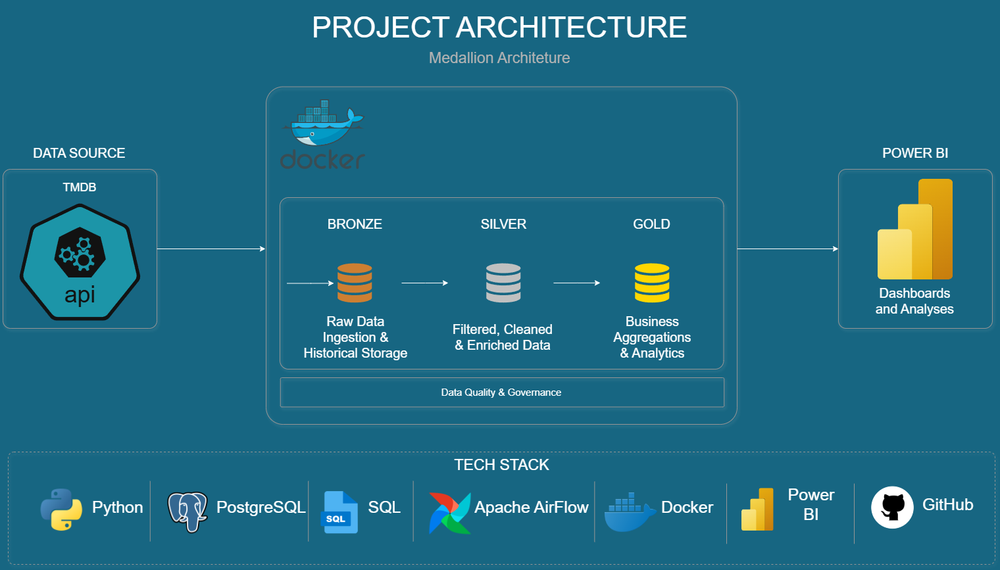
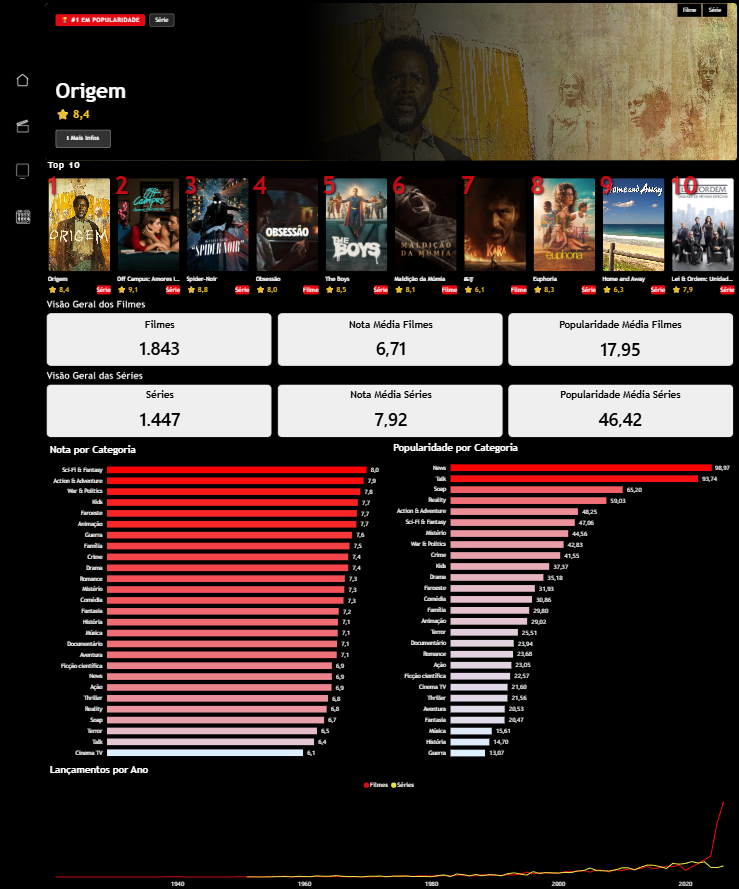

# 🎬 Data Pipeline End-to-End — TMDB API

## Roadmap Técnico do Projeto

**Arquitetura Medallion • Bronze → Silver → Gold**
**Docker • Apache Airflow • PostgreSQL • Power BI**

---

# 1. Visão Geral do Projeto

Este projeto consiste em um pipeline de dados end-to-end que integra a API pública do TMDB (The Movie Database) para coleta, processamento e visualização de dados sobre filmes e séries de televisão.

O objetivo principal foi construir uma solução próxima do mercado de trabalho, cobrindo todas as etapas de um projeto de engenharia de dados:

* Ingestão
* Transformação
* Modelagem
* Visualização

O pipeline foi desenvolvido utilizando:

* Arquitetura Medallion (Bronze, Silver e Gold)
* Docker
* Apache Airflow
* PostgreSQL
* Power BI

A camada de visualização foi implementada no Power BI com um layout inspirado em plataformas de streaming, utilizando técnicas avançadas de DAX e HTML Content para renderização dinâmica.

---

## 1.1 Objetivos

* Construir um pipeline de dados completo e automatizado integrado à API do TMDB
* Aplicar a arquitetura Medallion com camadas Bronze, Silver e Gold
* Containerizar toda a solução com Docker
* Orquestrar o fluxo de dados com Apache Airflow
* Persistir e modelar os dados no PostgreSQL
* Criar um dashboard interativo no Power BI com layout estilo streaming

---

## 1.2 Informações Gerais

| Item            | Descrição                     |
| --------------- | ----------------------------- |
| Fonte de Dados  | TMDB API (The Movie Database) |
| Tipo de Projeto | Pipeline de Dados End-to-End  |
| Ambiente        | Docker (Windows/Linux)        |
| Repositório     | GitHub                        |
| Status          | Finalizado                    |

---

# 2. Arquitetura do Projeto

O projeto segue a Arquitetura Medallion, padrão amplamente utilizado em projetos de engenharia de dados que organiza os dados em camadas progressivas de qualidade e refinamento.

---

## 2.1 Visão Geral da Arquitetura

| Camada | Propósito                                           | Formato              | Granularidade             | Responsável             |
| ------ | --------------------------------------------------- | -------------------- | ------------------------- | ----------------------- |
| Bronze | Ingestão e armazenamento histórico dos dados brutos | Delta Lake (Parquet) | Dados brutos da API       | `pipeline/extract.py`   |
| Silver | Limpeza, filtragem e enriquecimento                 | PostgreSQL           | Dados normalizados        | `pipeline/transform.py` |
| Gold   | Modelagem e Analytics                               | PostgreSQL           | Dimensões e Fatos para BI | `pipeline/load.py`      |

---

## 2.2 Fluxo de Dados

```text
TMDB API
    ↓
Extração (Python + Requests)
    ↓
Delta Lake (Bronze)
    ↓
Transformações (Pandas)
    ↓
PostgreSQL Silver
    ↓
Modelagem Dimensional
    ↓
PostgreSQL Gold
    ↓
Power BI
```

---

## 2.3 Tech Stack

| Tecnologia     | Camada         | Finalidade                      |
| -------------- | -------------- | ------------------------------- |
| Python 3.8+    | Todas          | Extração, transformação e carga |
| PostgreSQL     | Silver / Gold  | Persistência dos dados          |
| Apache Airflow | Orquestração   | Agendamento e monitoramento     |
| Docker         | Infraestrutura | Containerização                 |
| Delta Lake     | Bronze         | Armazenamento histórico         |
| SQLAlchemy     | Silver / Gold  | ORM e conexão                   |
| Pandas         | Silver / Gold  | Transformações                  |
| Power BI       | Visualização   | Dashboard                       |
| DAX            | Visualização   | Métricas e cálculos             |
| HTML/CSS       | Visualização   | Componentes visuais dinâmicos   |
| GitHub         | DevOps         | Versionamento                   |

---

# 3. Pipeline de Dados

## 3.1 Camada Bronze — Extração

Responsável pela coleta dos dados brutos da API TMDB e armazenamento histórico.

### Fontes de Dados

* Filmes populares
* Filmes Top Rated
* Filmes Trending
* Filmes Upcoming
* Séries Populares
* Séries Top Rated
* Séries Trending
* Séries Discover
* Detalhes completos dos títulos
* Elenco (Cast)
* Crew
* Networks
* Seasons

### Características Técnicas

* Paginação automática
* Controle de Rate Limit
* Salvamento incremental
* Schema Evolution
* Tratamento de erros por título

---

## 3.2 Camada Silver — Transformação

Responsável pela limpeza, normalização e enriquecimento dos dados.

### Transformações Aplicadas

* Seleção e renomeação de colunas
* Conversão de tipos
* Remoção de duplicidades
* Criação de URLs de imagens
* Normalização de estruturas aninhadas
* Top 10 atores por produção
* Filtragem de cargos relevantes da equipe técnica

### Tabelas Silver

| Tabela              | Tipo      | Descrição      |
| ------------------- | --------- | -------------- |
| silver_movies       | Fato Base | Filmes         |
| silver_tv_shows     | Fato Base | Séries         |
| silver_movie_genres | Bridge    | Filme × Gênero |
| silver_tv_genres    | Bridge    | Série × Gênero |
| silver_movie_cast   | Bridge    | Elenco         |
| silver_tv_cast      | Bridge    | Elenco         |
| silver_movie_crew   | Bridge    | Crew           |
| silver_tv_crew      | Bridge    | Crew           |
| silver_tv_networks  | Bridge    | Networks       |
| silver_tv_seasons   | Bridge    | Seasons        |

---

## 3.3 Camada Gold — Modelagem

Aplicação de regras de negócio e modelagem dimensional.

### Modelo Star Schema

| Tabela                    | Tipo     |
| ------------------------- | -------- |
| gold_fact_movies          | Fato     |
| gold_fact_tv_shows        | Fato     |
| gold_dim_movie_genre      | Dimensão |
| gold_dim_tv_genre         | Dimensão |
| gold_dim_person           | Dimensão |
| gold_bridge_movie_person  | Bridge   |
| gold_bridge_tvshow_person | Bridge   |
| gold_dim_network          | Dimensão |
| gold_dim_date             | Dimensão |

---

# 4. Infraestrutura e Orquestração

## 4.1 Docker

Toda a solução é executada via Docker Compose.

### Containers

* airflow-webserver
* airflow-scheduler
* airflow-init
* postgres

---

## 4.2 Apache Airflow

Responsável pela orquestração do pipeline ETL.

### Funcionalidades

* DAG principal
* Monitoramento via interface web
* Logs detalhados
* Reexecução individual de tarefas

Fluxo:

```text
Extract
   ↓
Transform
   ↓
Load
```

---

## 4.3 PostgreSQL

Banco de dados responsável pelas camadas Silver e Gold.

### Características

* Schema único (`public`)
* Chaves primárias compostas
* TRUNCATE CASCADE antes das cargas
* SQLAlchemy com pooling automático



---

# 5. Dashboard Power BI

Dashboard inspirado em plataformas de streaming conectado diretamente à camada Gold.

---

## 5.1 Estrutura do Dashboard

### Home

* Banner Principal
* Top 10
* KPIs
* Gráficos Analíticos

### Filmes

* Card Detalhe
* Elenco
* Filtros

### Séries

* Card Detalhe
* Elenco
* Filtros

---

## 5.2 Funcionalidades da Home

* Banner de destaque
* Filtro Filme/Série
* Filtro de Data
* Navegação entre páginas
* Top 10 com posters
* KPIs Gerais
* Gráficos analíticos

---

## 5.3 Funcionalidades das Páginas

### Filmes

* Busca textual
* Card de detalhe
* Elenco principal
* Ficha técnica
* Orçamento
* Receita
* Lucro
* ROI

### Séries

* Temporadas
* Episódios
* Networks
* Votos

---

## 5.4 Técnicas DAX Utilizadas

* TOPN + ALLSELECTED
* UNION + SELECTCOLUMNS + RANKX
* SUMMARIZE + GROUPBY
* CONCATENATEX
* FILTER + IN
* SELECTEDVALUE
* FORMAT + LEFT
* CSS

---

## 5.5 HTML Content

Utilizado para renderização dinâmica de componentes visuais.

### Componentes

* Banner principal
* Top 10
* Card de detalhe
* Cards de elenco
* Cards de resumo
* Card "Mais Informações"

---

# 6. Modelo de Dados — Star Schema

## 6.1 Relacionamentos

```text
gold_fact_movies
    ├── gold_bridge_movie_person
    ├── gold_dim_movie_genre
    └── gold_dim_date

gold_fact_tv_shows
    ├── gold_bridge_tvshow_person
    ├── gold_dim_tv_genre
    ├── gold_dim_network
    └── gold_dim_date

gold_dim_person
    ├── gold_bridge_movie_person
    └── gold_bridge_tvshow_person
```

---

## 6.2 Granularidade

### gold_fact_movies

Uma linha por:

```text
movie_id + genre_id
```

### gold_fact_tv_shows

Uma linha por:

```text
tv_show_id + genre_id + network_id
```

### gold_bridge_*_person

Uma linha por:

```text
id + person_id + role
```



---

# 7. Como Executar o Projeto

## 7.1 Pré-Requisitos

* Docker Desktop
* Python 3.8+
* Chave da API TMDB
* Power BI Desktop

---

## 7.2 Configuração

### Clonar Repositório

```bash
git clone <url-do-repositorio>
```

### Criar arquivo `.env`

```env
TMDB_API_KEY=YOUR_API_KEY
```

### Subir Containers

```bash
docker-compose up -d
```

---

## 7.3 Execução do Pipeline

### Airflow

```text
http://localhost:8080
```

### Execução Manual

```bash
docker-compose exec airflow-scheduler python -m pipeline.extract
```

### Fluxo

```text
extract
   ↓
transform
   ↓
load
```

Tempo estimado:

```text
20 a 40 minutos
```

---

# 8. Resultados e Métricas

## Destaques Técnicos

* Pipeline completo end-to-end
* Arquitetura totalmente containerizada
* Modelo dimensional otimizado
* Dashboard estilo streaming
* Integração de imagens do elenco
* Deduplicação inteligente via DAX

---

# 9. Considerações Finais

Este projeto demonstra a construção de um pipeline moderno de engenharia de dados cobrindo:

* Ingestão de APIs
* Transformação com Python e Pandas
* Arquitetura Medallion
* Modelagem Dimensional
* Orquestração com Airflow
* Containerização com Docker
* Visualização Analítica com Power BI

O principal diferencial está na combinação de boas práticas de engenharia de dados com uma camada de visualização altamente interativa, utilizando DAX avançado e HTML Content para reproduzir uma experiência semelhante a plataformas como Netflix e TMDB.

---

**Data Pipeline End-to-End — TMDB API • 2026**
